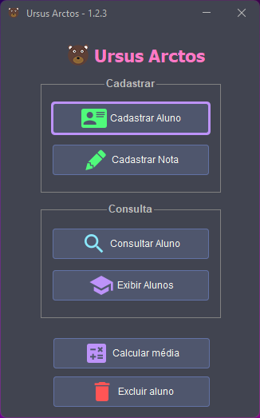

# Ursus Arctos

 

-----

## About

Project that uses _Swing_ to construct the graphical interface, and the stack structure to store student data.

Project was presented in the discipline of data structure as a study on stacks.

> Possibility to include a student in the stack and also a grade to it, even to calculate the class average.

> When you delete a student from the stack, all students who have been inserted after the deleted student are deleted.

## How to build

Run the __`build.bat`__ file for _Windows_ or __`build.sh`__ for _Linux_, both are in the root directory of this project

> After execution, the file __`ursus-arctos.jar`__ will be generated in the directory `target`

## Screenshot

